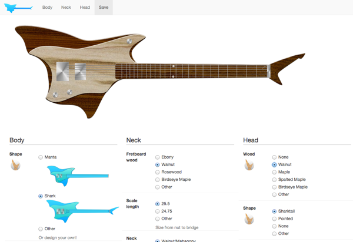

# What

Visual, 2D Tools for building custom guitars.

You can use the online tools at [design.sharktailguitars.com](http://design.sharktailguitars.com).

Or, if you are (even vaguely) familiar with Git and [Middleman](http://middlemanapp.com/), and want to create your own Virtual Guitar Builder,  you can clone this repo. 

Here are the basics to get started.

    git clone https://github.com/voodoo/site-guitar-builder builder
    cd builder
    bundle
    middleman

You can find the build inventory (which make up the form entries) file in 
data/build.yml

Once you get the builder like you want, all you have to do is 

    middleman deploy
    
Then you can send your friends (or builder) to your github page to check it out.

# License

Creative Commons

# Warranty

None
